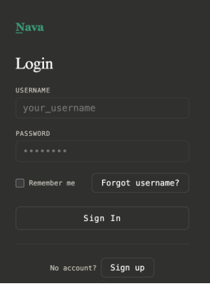

# Login Page — QA Interview Exercise

## Context

You are testing the Login Flow for a [NAVA application](https://denemorhun-nava.github.io/nava-qa-interview/).

- Login is handled through a mocked backend API and user data store.
- The login page has frontend field validations for username and password.
- After the user clicks Sign-in, the mocked backend determines whether the user has access.
- Users may have different account states, such as active, locked, or disabled.
- Users may have different roles, such as admin or standard user.
- Users must log in before accessing the dashboard or continuing their main workflow.

Your goal is to design a test strategy for the login flow, not just test the login form. 

Align on Acceptance Criteria, write test cases, execute them and log bugs. Include field validation, authentication behavior, user account states, 
role/access differences, error handling, and any missing requirements you would clarify before testing.

---
## Application

Go to [the login page](https://denemorhun-nava.github.io/nava-qa-interview/) in your browser to interact with the login page.

## Test Tooling 

Go to [The NAVA Test Tool](https://denemorhun-nava.github.io/nava-qa-interview/acceptance-criteria.html) to write up:
- Acceptance Criteria
- Test Case
- Bug
---

## Requirements

### Username
- Required field
- username must be greater than 5 characters and less than 21 in length
- Does not allow spaces
- only **alpha** characters and the following special characters **'@'** and **'.'**

### Password
- Required field
- must be masked
- username must be greater than 5 characters and less than 11 in length
- Only allows *alpha* characters and these special characters: **!@#$%**
- Entering any valid username and **secret!** in password field will enable user to authenticate

### Sign-in Button
  - Clickable

### Page-level validations
- Validations are performed when **Sign in** is clicked
- Validation messages appear under the field they apply to
- Validation messages:
  - `"This field is required"`
  - `"Invalid username/password"`

### Dashboard

- User should be greeted with the username used to log in
- Dashboard is for **standard** user view for this exercise

### Backend / Account Behavior for E2E

The backend may return different outcomes depending on the user account.
- Valid active user
- Locked/Disabled account
- Different user roles or account types
- Token-based login

## Screenshot



---

### Partial Login Page HTML

```html
<body>
  <div class="login-container" data-testid="login-wrapper">
    <h2 id="login-title">Login</h2>
    <form aria-labelledby="login-title" data-testid="login-form" novalidate>
      <label for="username">Username</label>
      <input type="text" id="username" name="username"
        aria-labelledby="login-title" data-testid="username-field">
      <label for="password">Password</label>
      <input type="password" id="password" name="password"
        aria-labelledby="login-title" data-testid="password-field">
      <button type="submit" data-testid="login-submit-button">Sign In</button>
    </form>
  </div>
</body>
```

## API

| Method | Endpoint | Notes |
|--------|----------|-------|
| GET | `/v1/user/login?username=<username>&password=<password>` | Password-based login |
| GET | `/v1/user/login?token=<token>` | Token-based login |
| POST | `/v1/user/account/create` | Body: `{ username, password, email }` |
| POST | `/v1/user/account/account_email` | Body: `{ username, type }` |

`email_type` accepts: `"forgot_password"` or `"forgot_username"`

---

## Database Schema

The backend and database are mocked for interview purposes. Assume the Users table controls account state, role, failed login behavior, and last successful login tracking.

```sql
TABLE Users (
    user_id              INT PRIMARY KEY AUTO_INCREMENT,
    username             VARCHAR(17) UNIQUE NOT NULL,
    email                VARCHAR(100) UNIQUE NOT NULL,
    password_hash        VARCHAR(255) NOT NULL,
    account_status       VARCHAR(20) NOT NULL, 
    role                 VARCHAR(20) NOT NULL,
    failed_login_attempts INT DEFAULT 0,
    last_login_at        DATETIME NULL,
    locked_at            DATETIME NULL,
    registration_date    DATETIME DEFAULT CURRENT_TIMESTAMP
)
) 
```
## CI/CD

Jobs are orchestrated via Jenkins CodePipelines. 


