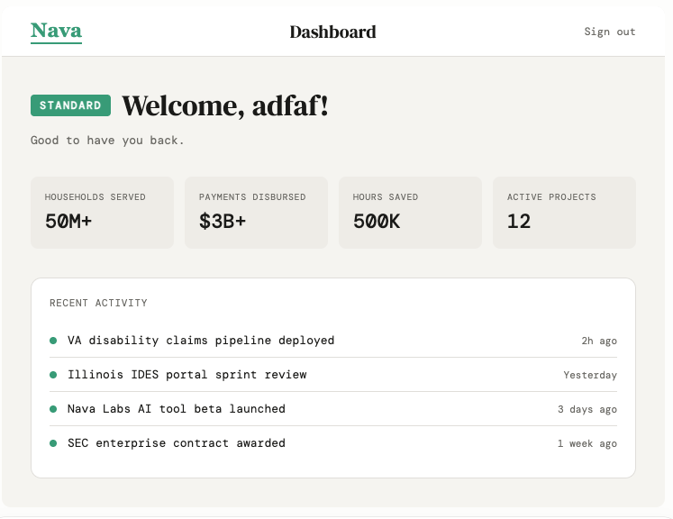

# Login Page — QA Interview Exercise

## Goal

Your goal is to **design a test strategy** for the **Login Flow**. 

During this exercise:
- Align on Acceptance Criteria
- Write and execute cases
- Find and log bug(s)

## Context

You are testing the Login Flow for a [NAVA application](https://denemorhun-nava.github.io/nava-qa-interview/), not just the login *form*.

- Users must log in before accessing the dashboard or continuing their workflow.
- Login is handled through a mocked backend API and user data store.
- The login page has frontend field validations for username and password.
- After the user clicks Sign-in, the mocked backend determines whether the user has access.
- Users may have different account states, such as active, locked, or disabled.
- Users may have different roles, such as admin or standard user.

## Requirements

**!** Clarify **scope**, authentication behavior, UI validations and any missing requirements before testing.

### Username Field
- Required field
- Username must be greater than 5 characters and less than 21 in length
- Does **not** allow **spaces**
- Only **alphanumeric** characters, **'.'** and a single instance of **'@'** are allowed (i.e. abc.123@navapbc.com)
- Username is case insensitive. 

### Password Field
- Required field 
- **secret!** is the test password to view dashboard
- Supports alphanumeric characters
- Must always be **masked**
- Password must be greater than 5 characters and less than 11 in length

### Sign-in Button
  - Clickable

### Page-level validations
- Entering any valid username and the string **secret!** in password field will enable user to authenticate
- Validations are performed when **Sign in** is clicked
- Validation messages appear under the field they apply to
- Validation messages:
  - `"This field is required"`
  - `"Invalid username/password"`

### Dashboard
- - **secret!** is the test password to view dashboard
- User should be greeted with the username used to log in
- Dashboard is only for **STANDARD** user view for this exercise
- Clicking **sign-out** should end the session

## Screenshots




---

### Partial Login Page HTML

```html
<body>
  <div class="login-container" data-testid="login-wrapper">
    <h2 id="login-title">Login</h2>
    <form aria-labelledby="login-title" data-testid="login-form" novalidate>
      <label for="username">Username</label>
      <input type="text" id="username" name="username"
        aria-labelledby="login-title" data-testid="username-field">
      <label for="password">Password</label>
      <input type="password" id="password" name="password"
        aria-labelledby="login-title" data-testid="password-field">
      <button type="submit" data-testid="login-submit-button">Sign In</button>
    </form>
  </div>
</body>
```
---
## API Mock

| Method | Endpoint | Notes |
|--------|----------|-------|
| GET | `/v1/user/login?username=<username>&password=<password>` | Password-based login |
| GET | `/v1/user/login?token=<token>` | Token-based login |
| POST | `/v1/user/account/sign_up` | Out of scope |
| POST | `/v1/user/account/forget_login` | Out of scope |

---
### Backend / Account Behavior for E2E Scenarios
The dashboard view should be different based on the user account. 
DB would return different outcomes for different states. 
- Valid active user
- Locked/Disabled account
- Different user roles such as standard or admin
- Token-based login
  
## Database Schema

The backend and database are mocked for interview purposes. Assume the Users table controls account state, role, failed login behavior, and last successful login tracking.

```sql
TABLE Users (
    user_id              INT PRIMARY KEY AUTO_INCREMENT,
    username             VARCHAR(17) UNIQUE NOT NULL,
    email                VARCHAR(100) UNIQUE NOT NULL,
    password_hash        VARCHAR(255) NOT NULL,
    account_status       VARCHAR(20) NOT NULL, 
    role                 VARCHAR(20) NOT NULL,
    failed_login_attempts INT DEFAULT 0,
    last_login_at        DATETIME NULL,
    locked_at            DATETIME NULL,
    registration_date    DATETIME DEFAULT CURRENT_TIMESTAMP
)
) 
```
## CI/CD
Jobs are orchestrated via Jenkins Pipelines. 


